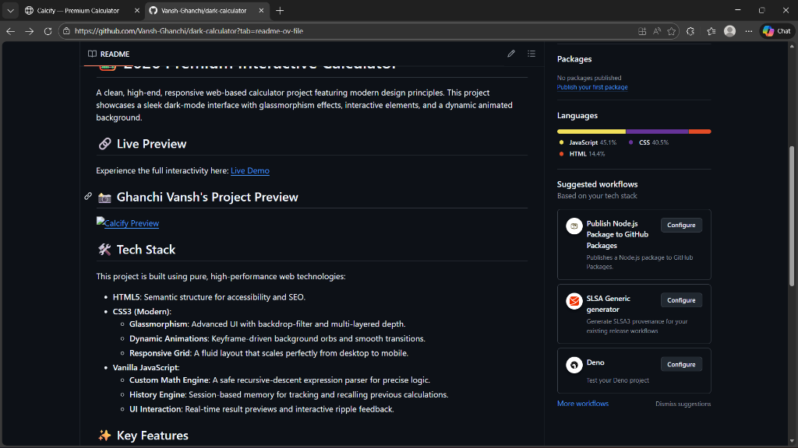

# 🧮 2026 Premium Interactive Calculator
A clean, high-end, responsive web-based calculator project featuring modern design principles. This project showcases a sleek dark-mode interface with glassmorphism effects, interactive elements, and a dynamic animated background.

## 🔗 Live Preview
Experience the full interactivity here: [Live Demo](https://Vansh-Ghanchi.github.io/dark-calculator/)

## 📸 Ghanchi Vansh's Project Preview


## 🛠️ Tech Stack
This project is built using pure, high-performance web technologies:

*   **HTML5**: Semantic structure for accessibility and SEO.
*   **CSS3 (Modern)**:
    *   **Glassmorphism**: Advanced UI with backdrop-filter and multi-layered depth.
    *   **Dynamic Animations**: Keyframe-driven background orbs and smooth transitions.
    *   **Responsive Grid**: A fluid layout that scales perfectly from desktop to mobile.
*   **Vanilla JavaScript**:
    *   **Custom Math Engine**: A safe recursive-descent expression parser for precise logic.
    *   **History Engine**: Session-based memory for tracking and recalling previous calculations.
    *   **UI Interaction**: Real-time result previews and interactive ripple feedback.

## ✨ Key Features
*   💎 **Glassmorphism Design**: Premium frosted-glass aesthetic for both the calculator and history panel.
*   📱 **Ultra-Responsive**: Perfectly balanced design that adapts to any screen size.
*   📜 **Calculation History**: Dedicated sidebar to track and recall previous results instantly.
*   ⌨️ **Full Keyboard Support**: Use Numpad or standard keys with interactive visual feedback.
*   ⚡ **Live Preview**: Real-time result calculation as you type, providing immediate accuracy.
*   🌌 **Ambient Background**: Smoothly animated fluid orbs that create a premium, modern feel.

## 🚀 How to Run Locally
Since this is a modern front-end project, it runs directly in any browser with zero installation.

1.  **Download/Clone the project**:
    ```bash
    git clone https://github.com/Vansh-Ghanchi/dark-calculator.git
    ```
2.  **Open the folder** and double-click `index.html`.

## 🧠 What I Mastered
*   **Math Logic Architecture**: Building a custom expression parser to handle math operations safely and accurately.
*   **Premium UI/UX Patterns**: Implementing glassmorphism and animated backgrounds while maintaining performance.
*   **Modern DOM Manipulation**: Using JavaScript to manage state and history while keeping the UI in sync.
*   **Professional Git Workflow**: Organizing project files and assets for high-quality production deployment.

Crafted with ❤️ by **Ghanchi Vansh**
